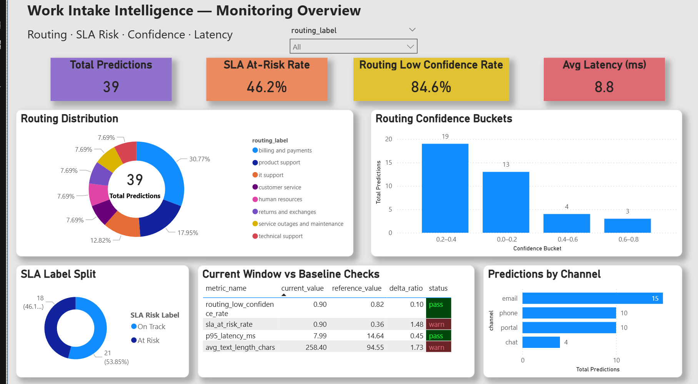

# Work Intake Intelligence

A lightweight Applied AI / Analytics Engineering portfolio project for:

- intelligent work-item routing
- SLA risk prediction
- operations monitoring

This project is designed to be:

- reproducible
- evaluable
- deployable
- monitorable
- interview-ready

---

## Problem

Operations teams often receive incoming tickets, requests, or work items from multiple channels. Manual triage is slow, inconsistent, and difficult to scale. SLA risk is also often identified too late.

This project simulates a practical internal AI workflow that helps:

- predict the most likely routing queue
- flag tickets likely to be at risk of SLA breach
- expose predictions through an API
- support monitoring and dashboard reporting

---

## Solution Overview

Work Intake Intelligence builds a lightweight end-to-end workflow that:

1. predicts the likely `routing_queue` from ticket text
2. predicts whether the ticket is at risk of SLA breach
3. serves predictions through a FastAPI `/predict` endpoint
4. writes structured prediction logs for monitoring
5. generates monitoring summaries for operations reporting
6. exports Power BI-ready monitoring outputs

---

## Data

The project started with synthetic data exploration, but the current baseline workflow uses a public support-ticket dataset as the primary text source.

### Current data approach
- public support-ticket text improves realism for routing classification
- English-only subset used for the baseline version
- raw public fields are standardized into a unified project schema
- additional structured fields such as `channel`, `requester_type`, and `created_hour` are programmatically derived
- `sla_risk` is a reproducible proxy label, not a historical ground-truth breach label

### Standardized fields
- `ticket_id`
- `title`
- `description`
- `channel`
- `priority`
- `requester_type`
- `created_hour`
- `routing_queue`
- `request_type`
- `language`
- `sla_risk`

---

## Technical Stack

- Python 3.11
- `venv`
- scikit-learn
- FastAPI
- public support-ticket dataset + standardized schema
- lightweight monitoring pipeline
- Power BI-ready reporting exports

---

## Modeling Strategy

### Routing model
- input: `title + description`
- baseline: TF-IDF + Logistic Regression
- preferred baseline: Logistic Regression with `class_weight="balanced"`

### SLA risk model
- input: structured ticket attributes
- baseline: Logistic Regression with encoded categorical features
- target: proxy `sla_risk` label derived from business-style heuristics

---

## Current Results

### Routing baseline
The routing task became more realistic after moving from templated synthetic text to public support-ticket text.

Current routing baseline characteristics:
- public ticket text classification
- class imbalance across queues
- balanced Logistic Regression retained as the preferred baseline
- moderate overall performance, with improved minority-class recognition after balancing

### SLA baseline
The SLA baseline uses structured fields:
- `channel`
- `priority`
- `requester_type`
- `routing_queue`
- `request_type`
- `created_hour`

Current SLA baseline achieved:
- accuracy around 0.83
- balanced performance across both classes
- a reproducible and interpretable proxy-risk workflow

### Key interpretation
- routing is harder because it depends on noisier free text and imbalanced multi-class labels
- SLA risk is easier because it uses structured features and a rule-aligned proxy label

Detailed discussion is documented in:

`reports/evaluation/baseline_summary.md`

---

## Inference API

A lightweight FastAPI service is included to demonstrate end-to-end inference.

### Endpoints

#### `GET /health`
Returns a simple health check response.

#### `POST /predict`
Runs a two-step inference flow:

1. predict the most likely `routing_queue` from ticket text
2. use the predicted queue together with structured inputs to predict `sla_risk`

### Example request

```json
{
  "title": "VPN connection keeps dropping",
  "description": "User reports unstable remote access since this morning and needs help urgently.",
  "channel": "email",
  "priority": "high",
  "requester_type": "external",
  "created_hour": 7,
  "request_type": "problem"
}
```

---

## Monitoring and Ops (MVP)

The API writes one structured prediction log event per `/predict` call.

Each log captures:
- request timestamp
- request ID
- model versions
- hashed / length-based input profile
- routing prediction and confidence
- SLA prediction and probability
- inference latency

A lightweight batch monitoring job compares a frozen reference profile against a recent prediction window.

Current MVP monitoring includes:
- average input length
- SLA at-risk rate
- routing low-confidence rate
- p95 latency

In a shifted demo workload, average input length and SLA at-risk rate increased enough to trigger warnings, while latency remained stable. This shows the monitoring layer can detect meaningful changes in request patterns even before production labels are available.

Related monitoring documentation:
- `reports/monitoring/output_schema.md`
- `reports/monitoring/drift_monitoring_design.md`
- `reports/monitoring/ops_playbook.md`

---

## Monitoring Dashboard

A Power BI monitoring page was built from exported prediction logs and monitoring check summaries.



The dashboard highlights:
- total predictions analyzed
- SLA at-risk rate
- routing low-confidence rate
- average latency
- routing distribution
- current-window vs baseline monitoring checks

In the shifted demo workload, input length and SLA risk rate increased enough to trigger warnings, while latency remained stable. This provides a lightweight but practical monitoring view for an AI-assisted intake workflow.

---

## Quick Start

### 1. Create environment
```bash
python -m venv .venv
```

### 2. Activate environment
Windows PowerShell
```bash
.venv\Scripts\Activate.ps1
```

### 3. Install dependencies
```bash
pip install -r requirements.txt
```

### 4. Run API
```bash
uvicorn src.api.main:app --reload
```

### 5. Open API docs
Visit:

```text
http://127.0.0.1:8000/docs
```

### 6. Generate monitoring summary
```bash
python -m src.monitoring.reference_profile
python -m src.monitoring.run_monitoring
python -m src.monitoring.export_monitoring_csv
```

---
## Demo Run

### Start API
```bash
uvicorn src.api.main:app --reload
```

### Run smoke test
```powershell
.\scripts\smoke_test_api.ps1
```

### Refresh monitoring outputs
```bash
python -m src.monitoring.run_monitoring
python -m src.monitoring.export_monitoring_csv
```

### Demo artifacts
- API docs: `http://127.0.0.1:8000/docs`
- monitoring screenshot: `reports/monitoring/assets/monitoring_dashboard.png`
- demo runbook: `reports/demo/demo_runbook.md`

---

## Project Structure

```text
src/
  api/
  data/
  monitoring/

reports/
  evaluation/
  monitoring/

data/
  monitoring/

scripts/
```

---

## Next Steps

Planned next improvements:
- add routing class-mix drift checks
- expand confidence monitoring with top-k outputs
- add alert thresholds and notification hooks
- document retrain / rollback workflow more explicitly
- extend the Power BI dashboard with additional operational views
