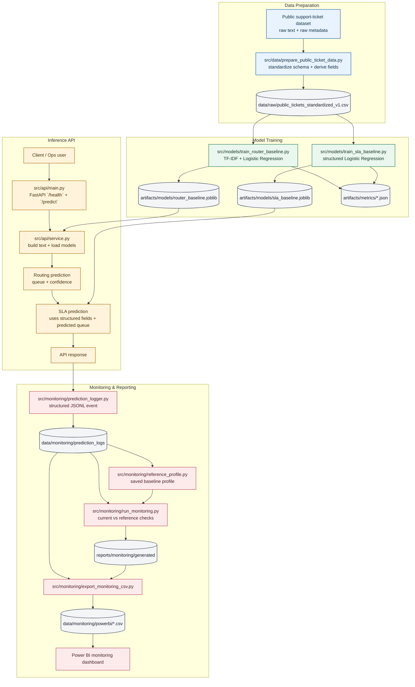

# Final Release Notes

## Work Intake Intelligence - MVP Release

This release includes an end-to-end Applied AI / Analytics Engineering workflow for:

- ticket routing prediction
- SLA risk prediction
- API serving
- prediction logging
- lightweight monitoring
- Power BI operations reporting

### Included in this release
- standardized support-ticket data preparation
- TF-IDF + Logistic Regression routing baseline
- structured Logistic Regression SLA baseline
- FastAPI `/health` and `/predict` endpoints
- structured prediction logging
- reference-profile vs current-window monitoring summary
- monitoring documentation and ops playbook
- Power BI monitoring dashboard screenshot and CSV exports

### Key project themes
- reproducibility
- lightweight deployment
- practical monitoring
- interview-ready system design

## Detailed Architecture

### Diagram legend
- Blue: data preparation
- Green: model training
- Gold: inference serving
- Rose: monitoring and reporting
- Gray: stored datasets, models, metrics, and exports
